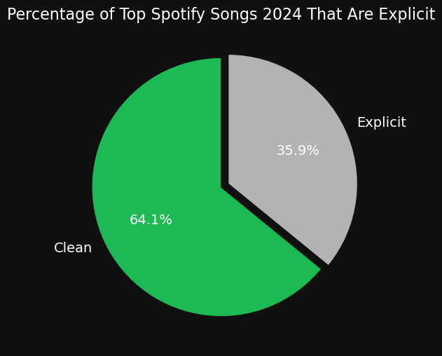
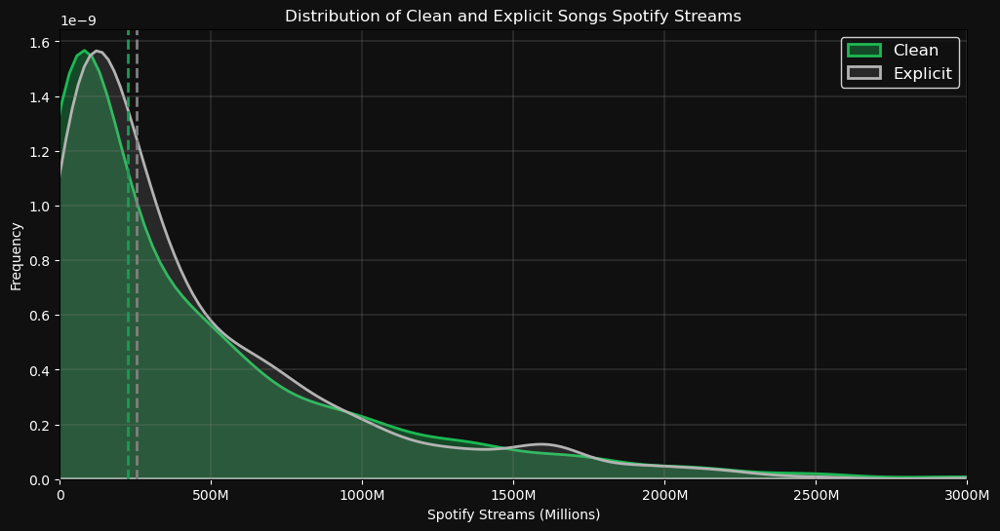
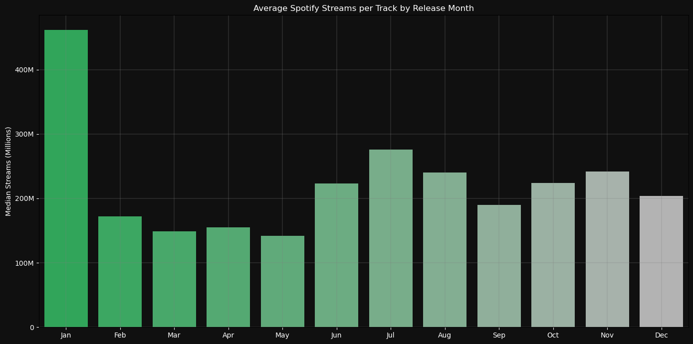

# Overview
Welcome to my analysis on Spotify's Top songs in 2024. This project aims to provide some insight into the factors that affect the number of streams a song is getting on Spotify. Going into the project, I knew that I wanted to focus more on data visualisation, so I took an already fairly clean dataset and created some rather interesting and aesthetically pleasing plots that fit the Spotify theme. \
The overall purpose of this project is to be presented in my portfolio, so I tried to showcase a range visualisation skills using Python, and escpecially Pandas. \
Credit to Nidula ElgiriyeWithAnA on Kaggle for the [dataset](https://www.kaggle.com/datasets/nelgiriyewithana/most-streamed-spotify-songs-2024?resource=download)

# The Questions
For this project I had a number of questions, but the dataset I found only allowed for 2 of them to be answered. In the future, I will likely return to this project with a new dataset to answer the remaining questions, but for now I believe the project displays my visualisation skills well. 
1. What percentage of tracks are labelled as "Explicit"?
    - Does a song being explicit affect its streams?
2. How does the time of year that a song was release affect its spotify streams

# Tools & Technologies I used
- Python: All coding and analysis was done inside Python. I also used Python libraries including but not limited to:
    - Pandas: Used to analyse the data.
    - Matplotlib: Visualised some of the data.
    - Seaborn: Created the more advanced visuals.
- Jupyter notebooks: All code was completed inside of Jupyter notebooks, and all are available inside this repository (including comments to explain my work).
- Visual Studio Code: My personal favourite IDE.
- Git & GitHub: Used to share my work!

# The Analysis
Each Jupyter notebook tackles one full question, including any potential subquestions. Access to each notebook, including test code and comments, is available and linked with each question. Exploratory analysis following the generated plots is completed below.

## 1a. What percentage of tracks are labelled as "Explicit"?

Before answering this question, I undertook some necessary data cleaning, which included changing some data types. \
Once this was done, I summed the total count of songs, and plotting the number that was labelled as "Explicit" against those that were clean. \
Analysis for both parts of this question will be completed after the results. \
View my notebook that outlines all the steps I took, with all comments intact: [2_explicit_tracks.ipynb](2_explicit_tracks.ipynb)

### Data Cleaning
```python
df['release_date'] = pd.to_datetime(df['Release Date']) 
df = df.drop('Release Date', axis=1)
df['explicit_track'] = df['Explicit Track'].astype('category')

def safe_to_int(value):
    try:
        return int(value.replace(',', ''))
    except AttributeError:
        return None

columns_to_convert = df[['Spotify Streams', 'YouTube Views', 'Spotify Playlist Count',
                         'YouTube Likes', 'TikTok Posts', 'TikTok Likes', 'TikTok Views',
                         'Soundcloud Streams']]
for col in columns_to_convert:
    df[col] = df[col].apply(safe_to_int)
```

### Visualise Data
```python
colors = [spotify_green, button_gray] # Easily change palette colour
explode = [0, 0.06] # Change the padding

# Set the theme to dark, to fit Spotify's colour scheme
fig, ax = plt.subplots(figsize=(6, 6))
fig.patch.set_facecolor(background_color)
ax.set_facecolor(background_color)

# Plot the pie chart
wedges, texts, autotexts = ax.pie(explicit_counts, labels=labels, autopct='%1.1f%%', startangle=90, 
                                  colors=colors, wedgeprops=dict(edgecolor=background_color), explode=explode)

# Title, changing texts
plt.title('Percentage of Top Spotify Songs 2024 That Are Explicit', color='w', fontsize=(16))
for text in texts + autotexts:
    text.set_color('w')
    text.set_fontsize(14)

plt.show()
```

### Results


## 1b. Does a song being explicit affect its streams?
To answer this question, I generated a pair of kde plots. I then added vertical lines at the respective medians, and performed customisations to ensure the plot fits the Spotify theme.

### Visualise Data
```python
sns.kdeplot(df[df['Explicit Track'] == 0]['Spotify Streams'], color=spotify_green, label='Clean', fill=True, alpha=0.35, linewidth=2)
sns.kdeplot(df[df['Explicit Track'] == 1]['Spotify Streams'], color=button_gray, label='Explicit', fill=True,alpha=0.15, linewidth=2)
plt.xlim(0, 3e9)
ax = plt.gca()
ax.xaxis.set_major_formatter(plt.FuncFormatter(lambda x, pos: '0' if x == 0 else f'{int(x / 1_000_000)}M'))

ax.axvline(df[df['Explicit Track'] == 0]['Spotify Streams'].median(), color='#1A9C55', linestyle='--', lw=2)
ax.axvline(df[df['Explicit Track'] == 1]['Spotify Streams'].median(), color='#808080', linestyle='--', lw=2)
```

### Results


### Insights

The percentage of top Spotify songs that are explicit stands at 35.9%, compared to 64.1% that are clean. This indicates that over one-third of the most popular tracks feature explicit content. The distribution of streams also reveals interesting patterns.

For explicit songs, the median number of streams is notably higher compared to clean songs, suggesting that explicit tracks generally attract more listens. The distribution plots show that both clean and explicit songs peak in frequency at lower stream counts (0-200 million streams), but as the stream count rises, the frequency drops, showing a right-skewed pattern typical for streaming data.

Clean songs, making up 64.1% of the top songs, follow a similar distribution pattern but with a slightly lower median stream count than explicit songs. This trend highlights a possible listener preference or industry focus that drives higher streams for explicit content.

Several factors might contribute to these differences. Audience preference for more authentic or relatable content could drive higher streams for explicit songs. Additionally, explicit songs may receive more aggressive marketing and playlist placements. The popularity of artists who produce explicit content can also skew the average streams higher for these tracks. Genre differences might also play a role, with certain genres that are more popular on streaming platforms tending to have more explicit content.

### Summary
Explicit songs, accounting for 35.9% of the top tracks, tend to have higher median streams than clean songs. Clean songs, though more prevalent, have a slightly lower median stream count. Various factors such as audience preference, marketing strategies, artist popularity, and genre differences could influence the higher stream counts for explicit songs. The overall distribution shows a typical right-skewed pattern for both categories, with a high frequency at lower stream counts and a long tail of songs with very high streams.

## 2. How does the time of year that a song was release affect its spotify streams?
I wanted to investigate how the time of year that a song is released affects its average streams, on a month-to-month basis. To avoid biased data, I first ensured that outliers were removed from the dataset. From there, I converted the date release to twelve columns of data, one for each month of the year, and found the median streams for songs of each month. From there, I decided to represent the data with a bar chart, as I believed this would best showcase the trend and possible relationship. \
View my notebook that outlines all the steps I took, with all comments intact: [3_release_date_streams.ipynb](3_release_date_streams.ipynb)

### Visualise data
```python
plt.figure(figsize=(14, 7))
sns.barplot(x='release_month', y='Spotify Streams', data=monthly_avg, 
            hue='release_month', palette="blend:#1DB954,#B3B3B3", legend=False)

ax = plt.gca()
ax.yaxis.set_major_formatter(plt.FuncFormatter(lambda y, pos: '0' if y == 0 else f'{int(y / 1_000_000)}M'))

fig = plt.gcf()
fig.patch.set_facecolor(background_color)
ax.set_facecolor(background_color)
ax.tick_params(axis='both', colors='w')

ax.grid(color='gray', linewidth=0.3)
plt.xlabel('')
plt.ylabel('Median Streams (Millions)', c='w')
plt.title('Average Spotify Streams per Track by Release Month', c='w')
plt.tight_layout()
plt.show()
```

### Results


### Insights


The distribution of average Spotify streams per track by release month reveals notable trends. The data indicates that songs released in January achieve the highest median streams, significantly surpassing those of other months.

Songs released in January reach a median stream count of over 400 million. Following January, the months of July and June also show high median stream counts, though significantly lower than January’s peak. In contrast, the remaining months exhibit relatively lower median streams, with March and May being among the lowest.

The differences in average streams can be explained by several factors. The high streams in January could be attributed to new year releases, where artists capitalise on the holiday season aftermath and new year resolutions, drawing significant attention and streams. In contrast, the increased streams in June and July may be due to summer hits and festivals, where new music is often released to coincide with summer events, leading to higher engagement and streaming.

December shows a moderate level of streams, possibly benefiting from holiday season releases and year-end charts. However, it does not reach the peak seen in January due to the shorter duration within the year for accumulating streams. On the other hand, the lower streams in February, March, April, and May might be due to fewer high-profile releases or less promotional activity during these months. These periods might not have as many strategic releases compared to the beginning and middle of the year.

### Summary
January leads with the highest median streams per track, likely due to strategic new year releases. June and July also show strong performance, aligning with summer events and festivals. The lower streams in February, March, April, and May suggest fewer high-impact releases or promotions during these months. The moderate streams in December could be driven by holiday season releases, though not as impactful as January due to limited streaming time within the year.

## Reflection

Through completing this project, I deepened my understanding of streaming data in the music industry; including possible strategies that artists use to maximise potential streams. The key skills I wished to improve upon by completing this project were my visualisation skills, including fitting plots to a theme, and choosing the most appropriate plot types. I feel this project has significantly strengthened these skills, and moving forward, I will be far more comfortable with the visualisation side of Data Analysis. \
I am currently undertaking an internship at the UK Space Agency, as a research intern, and I hope that some of the skills that I practised during this project will allow me to perform similar analysis on the work I am doing. Perhaps in the coming weeks I will add a project that details the work being done there, as I am sure there will be opportunity for data analysis.
- I gained further appreciation for how the use of certain libraries in conjunction with oneanother simplifies the whole Data Analysis process. In particular, using Seaborn and Pandas together made creating aesthetically pleasing plots relatively easy.
- I learned that spending time finding a fitting dataset is important, as whilst I answered some insightful questions, some of the questions I had going into this project remain unanswered. Upon returning to this project, I will ensure that the chosen dataset contains all the raw data necessary.
- As mentioned, I feel far more comfortable with the visualisation side of data analysis, using the FuncFormatter function of matplotlib came in especially handy in making some final touches to plots to ensure readability and visual clarity.

I now feel a lot more comfortable with fitting plots to a theme, and moving forward, if appropriate, will continue with this trend.


## Challenges I Faced
Completing this project did not come without its own challenges. A lot of these came in the form of trying to remain faithful to the theme, whilst ensuring maximum visual clarity. Some experimentation was needed to find the correct alpha of plots; shade of colours; general colour scheme; etc. It was through this experiementation, however, that I managed to create a few plots that I am very pleased with, and could easily extend into new projects and themes. \
Moving on from my previous project, which involved looking at job market data for the data industry in the UK, I felt far more comfortable with data cleaning and manipulating dataframes. \
The main challenge that holds this project from going into further depth comes from the limited scope of the dataset. Moving forward, I will make sure to choose a dataset that contains all the raw data for me to answer all the questions that initially draw me to the project; unless I am provided with a dataset and questions from an outside party.


## Conclusion

Overall, the project was a great success. Although relatively short, I managed to find some meaningful insights about Spotify's streaming trends, and significantly developed my skills in data visualisation and remaining loyal to a theme. \
I learned a great deal during the project, and now feel far more comfortable with using Pandas and Seaborn, as well as Git/ GitHub (This is my second uploaded piece of work on GitHub). \
For the time being, this should conclude my projects in Python, as I would like to showcase my skills in R and SQL. \
I now have a deeper appreciation for the aesthetic side of data visualisation, so moving forward I would like to learn Power BI. After my R and SQL projects, I will aim to complete some visualisations in Power BI, or I could potentially showcase the skills I learn there alongside some other languages and tools in the same project. \
If I were to come back to this project, I would make sure to choose a more appropriate dataset for the set questions, and may potentially choose to experiment with other data visualisation tools such as Power BI, to compare the plots generated to those seen in this project.


## Thank you
Thank you for checking out my project. My background is in Physics, so most coding is self taught outside of the Python and R modules I completed at university. If you have any feedback please let me know.

Archie Sewell